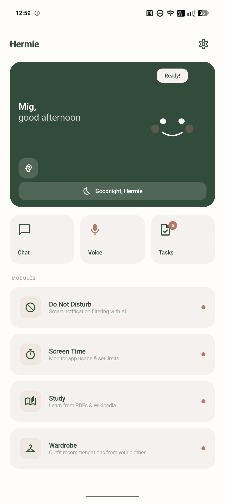
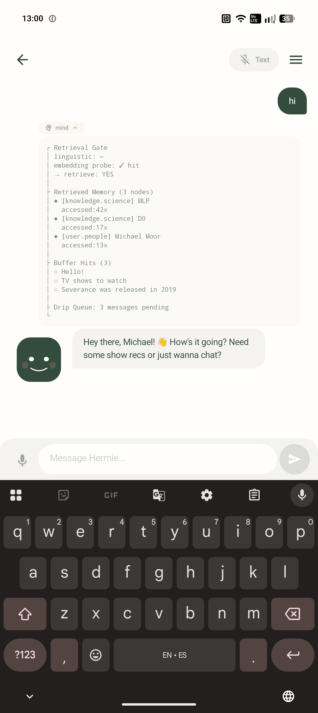
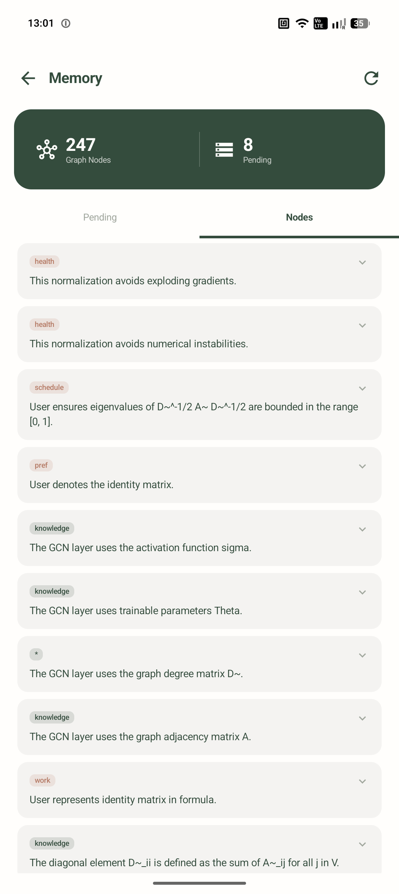
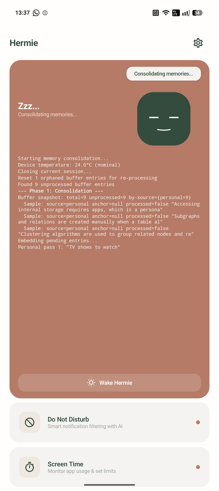
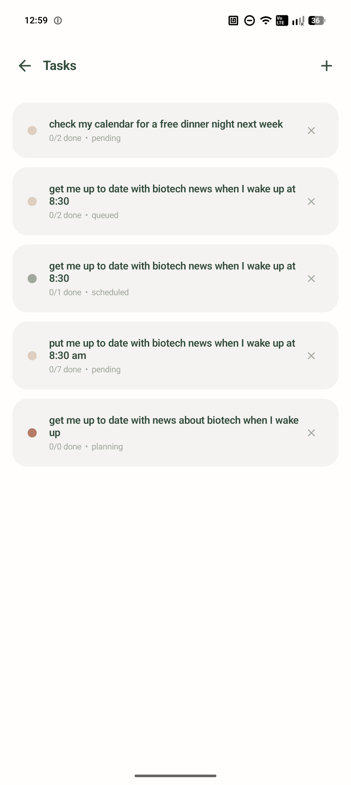
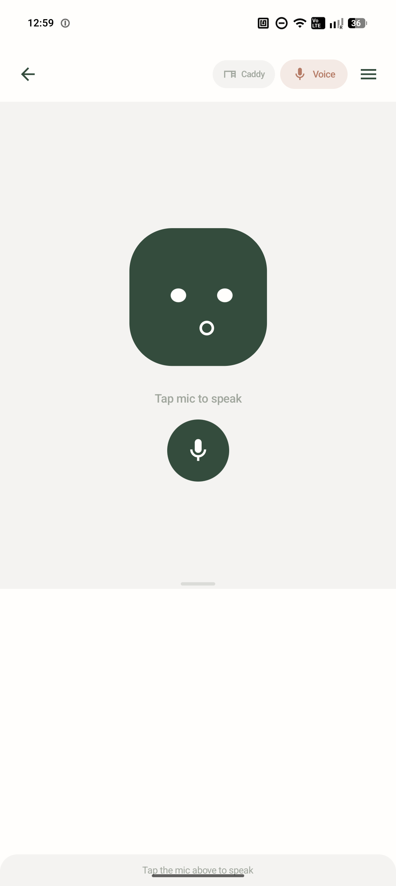

# Hermie

Fully on-device Android AI assistant. Dual-LLM architecture backed by a persistent graph memory database, running entirely on consumer phone hardware (targeting 12GB RAM).

## Screenshots

| | |
|---|---|
|  Home screen |  Chat, memory retrieval debug trace (retrieval gate, retrieved nodes, buffer hits, drip queue) |
|  Graph memory browser: 247 nodes, category-tagged facts |  Sleep-mode consolidation log (buffer snapshot, phase-by-phase processing) |
|  Tasks (WIP) |  Voice mode |

## Architecture

```
┌─────────────────────────────────────────────────────┐
│                     User Input                      │
│              (text / voice / system event)           │
└──────────────┬──────────────────────┬────────────────┘
               │                      │
        ┌──────▼──────┐        ┌──────▼──────┐
        │    Brain    │        │    Mind     │
        │  Qwen 3.5   │        │  Qwen 3.5   │
        │    4B Q4     │        │  2B Q2/Q4   │
        │             │        │             │
        │  Slot 0:    │        │  LoRA hats: │
        │   Chat/Task │        │   Router    │
        │  Slot 1:    │        │   Atomizer  │
        │   Tool Exec │        │   Triage    │
        │   /Worker   │        │   DnD       │
        └──────┬──────┘        └──────┬──────┘
               │                      │
        ┌──────▼──────────────────────▼──────┐
        │          Graph Memory DB           │
        │  SQLite: nodes + edges + buffer    │
        │  MiniLM-L6-v2: 384-dim embeddings  │
        │  REMINDRAG edge reinforcement      │
        └────────────────────────────────────┘
```

**Brain** (~2.5GB): main conversational model. Runs via llama.cpp through JNI with two inference slots sharing a single model load. Slot 0 carries chat history, Slot 1 is ephemeral (tool execution during active use, consolidation worker during sleep).

**Mind** (~0.8-1.2GB): background specialist for single-turn jobs. Swaps LoRA adapters ("hats") per task. Runs on a separate engine instance, fully parallel with the Brain.

**MiniLM-L6-v2** (TFLite, ~25MB): 384-dim sentence embeddings for semantic retrieval.

**Voice**: Whisper (on-device STT), Kokoro TTS (ONNX int8, ~25MB).

---

## What's Implemented

### Graph Memory (v4)

**Nodes** are atomic facts (`"allergic to shellfish"`, `"works as PM, manager is Mike"`). Each has a 384-dim embedding, category tag, source type (`personal`, `study`, `study_anchor`), and timestamps.

**Edges** connect related nodes. Each edge carries a 384-dim embedding vector that starts at zero and learns over time which queries benefit from traversing it (REMINDRAG).

**Retrieval pipeline:**
1. Linguistic gate (regex triggers like "remember", "you told me")
2. Embedding probe (cosine scan, fires if any node > 0.5 similarity)
3. DFS expansion from seed nodes, scored as `α·node_similarity + (1-α)·edge_alignment`, depth 4, capped at 9 nodes
4. Injected as `[MEMORY CONTEXT]` into the Brain's input

**Edge reinforcement (post-response):** embed the Brain's response, check similarity against each retrieved node. High similarity (≥ 0.4) enhances the traversed edge toward the query direction. Low similarity (< 0.3) penalizes by stripping the query-aligned component. Uses the REMINDRAG weight function `δ(‖v‖) = (2/π)·cos(π/2·‖v‖)` for fast wakeup on fresh edges and damped updates on mature ones.

**Drip atomization:** Mind processes raw user messages in background idle windows, extracts durable facts or discards. Deduped via Jaccard similarity > 0.75.

**Sleep consolidation:** Brain processes the accumulated buffer into graph nodes and edges. Separate consolidation prompts for personal facts (categorize + link) vs study material (synthesize into concepts).

**Exploratory linking:** perpetual sleep-mode loop that samples mid-similarity cross-category node pairs (cosine 0.30-0.55), asks the Brain if a real relationship exists, creates edges seeded with meaningful embeddings. Catches connections that cosine similarity alone misses.

### Study Mode

Ingest PDFs, Wikipedia articles, web pages into the graph. A `study_anchor` node is created per document, all extracted facts link back to it.

### Smart Screen Time

Personality-driven screen time management with escalating interventions:

- **Level 0** (concerned): friendly notification bubble
- **Level 1** (annoyed): firmer tone, context-aware
- **Level 2** (firm): final warning + accessibility service sends user to home screen

Per-app daily conversation threads track every interaction (messages, replies, app close/reopen events, dismissals). Full thread injected into each LLM call for context. Cross-day callbacks: 30% chance the first message of a new day references yesterday's excuse.

Bubble re-fire on dismissal (15s delay, new LLM message), giveup after second dismissal.

### Smart Do Not Disturb

Mind classifies incoming notifications and suppresses based on content, sender, time of day, and user activity.

### Desk Caddy

Always-listening voice mode. Phone sits on desk, Hermie listens and responds via TTS, stays ready for next command.

### Chat and Voice

Text chat with streaming token output, voice chat with Whisper STT and Kokoro TTS. Conversation history maintained in Brain Slot 0's KV cache.

---

## What's Next

### Multi-Slot + LoRA Hat Architecture

The current Mind (SmolLM2 360M) is too small to be useful beyond basic classification. Upgrading to Qwen 3.5 2B with swappable LoRA adapters opens up specialist behavior per task.

**Brain slots:**
- Slot 0: Chat or Task (swap system prompt based on mode, only slot with persistent KV cache)
- Slot 1: Tool executor during active use, consolidation worker during sleep

**Mind hats (LoRA adapters):**

| Hat | Purpose | Dataset Size |
|-----|---------|-------------|
| Tool Router | Intent detection: tool / noop / cancel | ~2-3K examples |
| Fact Atomizer | Extract durable facts from messages | ~3-5K, 60% nulls |
| Consolidation Triage | Pre-filter buffer for sleep consolidation | ~2-3K examples |
| Notification Triage | DnD filtering + priority scoring | Prompt first, LoRA if needed |

**Brain LoRA adapters:**

| Hat | Purpose | Dataset Size |
|-----|---------|-------------|
| Tool Execution | Parse commands, extract params, execute | ~5-10K examples |
| Graph Consolidator | Create/merge nodes and edges | ~3-5K examples |

All datasets built via knowledge distillation from larger teacher models.

### Tool System

Tools execute through Android system APIs. The pipeline:

```
Message -> Heuristic check (~5ms, catches ~70%)
        -> If ambiguous: Mind (router hat, ~150ms)
        -> If tool: Brain Slot 1 (tool LoRA) -> Brain Slot 0 confirms in chat
        -> If no tool: Brain Slot 0 chat response
```

Multi-tool support for independent parallel commands (output always an array). Chained/dependent calls handled conversationally across turns.

**Tool list:**
```
alarm.set, alarm.cancel, timer.set,
reminder.set, reminder.list, reminder.cancel,
calendar.add, calendar.query,
phone.call, phone.text, whatsapp.send, contact.lookup,
music.play, music.pause, music.skip, music.volume,
flashlight.toggle, brightness.set, dnd.toggle, app.open,
navigate.to, calculate, web.search, study, note
```

### Latency Targets

| Scenario | Perceived Latency |
|----------|------------------|
| Simple chat | ~2.2-4.2s |
| Chat with memory retrieval | ~2.7-4.8s |
| Simple tool execution | ~1.3-2.3s |
| Complex tool chain | ~5-8s |

Mind's per-message work (~400ms) runs parallel with Brain generation (~2-4s), adding zero perceived latency.

### Memory Fixes

**Retrieval feedback loop:** reinforced edges dominate retrieval. Planned: retrieval recency penalty, temporal decay on edge embeddings (~0.995/day), potential beam search instead of DFS.

**Drip quality:** replace prompt-engineered atomization with finetuned atomizer LoRA on the upgraded Mind.

**Consolidation quality:** process entries one at a time with context reset, use Mind triage hat to pre-filter, finetune a consolidation LoRA for the Brain.

### Other Planned Features

**Notification summarization:** morning briefing grouping overnight notifications into a concise summary.

**Smart clipboard:** detect copied text type (address, tracking number, phone number, meeting time) and offer contextual actions via local inference.

**Background agentic tasks:** iterative multi-step tasks with tool usage running in the background with progress updates.

---

## Tech Stack

- **Language**: Kotlin (app), C++ (inference via JNI)
- **UI**: Jetpack Compose, single-activity
- **Inference**: llama.cpp (NDK), multi-slot server mode
- **Models**: Qwen 3.5 4B (Q4), Qwen 3.5 2B (Q2/Q4), MiniLM-L6-v2 (TFLite)
- **TTS**: Kokoro (ONNX Runtime, int8)
- **STT**: Whisper (on-device)
- **Database**: SQLite (graph: nodes, edges, buffer)
- **Training**: Unsloth + QLoRA, teacher-student distillation
- **Target**: Android 12+, 12GB RAM (may fit on 8GB)